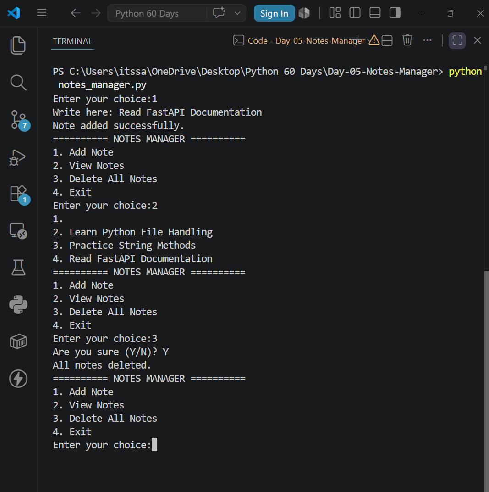

# 📝 Day 5 – Notes Manager

## 📌 Project Overview

This project is a command-line Notes Manager built using Python. It allows users to create, view, and delete notes while storing data permanently using text files.

Unlike previous projects that stored data only in memory, this application introduces persistent storage through file handling.

---

## 📚 Concepts Learned

- Strings
- File Handling
- Reading Files
- Writing Files
- Appending Data
- Functions
- While Loops
- Menu-Driven Programs
- enumerate()
- with open()

---

## 🚀 Features

- ➕ Add Note
- 📖 View Notes
- 🗑️ Delete All Notes
- 🚪 Exit Application

---

## 🛠️ Technologies Used

- Python 3

---

## 📂 Project Structure

```text
Day-05-Notes-Manager/
│
├── notes_manager.py
├── notes.txt
├── README.md
└── images/
    └── output.png
```

---

## ▶️ How to Run

```bash
python notes_manager.py
```

---

## 📷 Output



---

## 💡 Key Learning

This project introduced file handling in Python and demonstrated how to store information permanently using text files. I also learned the importance of choosing the correct file mode (`r`, `w`, and `a`) and writing modular code using functions.