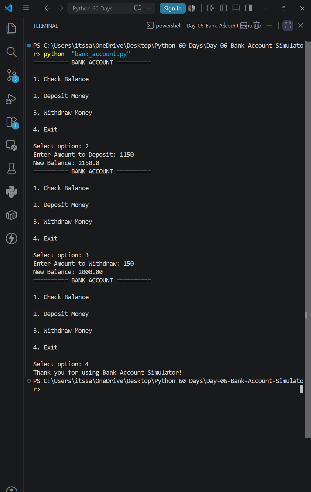

# 🏦 Day 6 – Bank Account Simulator

## 📌 Project Overview

The Bank Account Simulator is a command-line Python application that simulates basic banking operations while introducing exception handling to prevent the program from crashing due to invalid user input.

---

## 📚 Concepts Learned

- Exception Handling
- try
- except
- ValueError
- Functions
- Global Variables
- Menu-Driven Programming
- Input Validation

---

## 🚀 Features

- 💰 Check Balance
- ➕ Deposit Money
- ➖ Withdraw Money
- ⚠️ Handle Invalid Inputs
- 🚪 Exit Application

---

## 🛠️ Technologies Used

- Python 3

---

## 📂 Project Structure

```text
Day-06-Bank-Account-Simulator/
│
├── bank_account.py
├── README.md
└── images/
    └── output.png
```

---

## ▶️ How to Run

```bash
python bank_account.py
```

---

## 📷 Output



---

## 💡 Key Learning

This project helped me understand Python Exception Handling using `try` and `except`. Instead of allowing the program to crash when users enter invalid data, I learned how to catch exceptions and display meaningful error messages, improving the overall user experience.